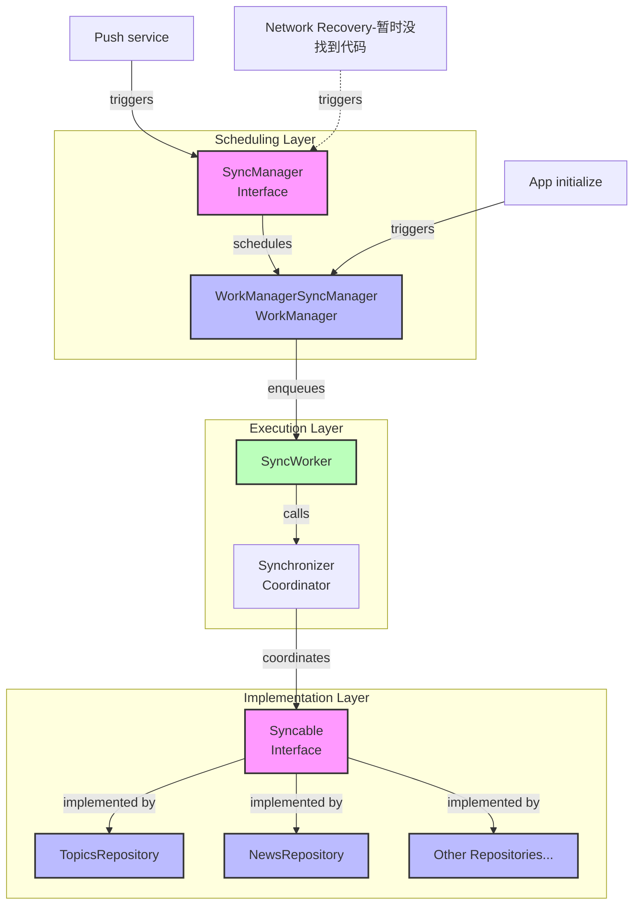

## 准备工作

在学习本章之前，我们一起尝试来解决下面几个问题。

*   [ ] 1：viewmodel 是属于数据层吗？
*   [ ] 2：你知道哪些数据层的架构组件？
*   [ ] 3：Repository 类的主要目职责是什么？
*   [ ] 4：Data source 的主要职责是什么，如何使用呢？
*   [ ] 5：Respository 对外提供 API 有哪些需要注意的？
*   [ ] 6：Respository 的命名规范是怎么样的？
*   [ ] 7：如何理解 source of truth （可信数据源）？
*   [ ] 8：数据操作有哪些类型？
*   [ ] 9：常见的数据任务有哪些？
*   [ ] 10：如何设计一个离线优先的应用？
*   [ ] 11: 应用数据与网络数据有哪些同步的手段，他们有哪些区别？
*   [ ] 12：如果是你该如何设计冲突解决方案呢？

然后带着这些问题我们先来阅读官方文档，[数据层简介](https://developer.android.com/topic/architecture/data-layer?hl=zh-cn)，[构建离线优先应用](https://developer.android.com/topic/architecture/data-layer/offline-first?hl=zh-cn)，[data store](https://developer.android.com/topic/libraries/architecture/datastore?hl=zh-cn)，[work manager](https://developer.android.com/topic/libraries/architecture/workmanager?hl=zh-cn)。由于此章文档内容很长，概念繁多，如果没有时间的同学，快速过一下即可，不强求每个细节每个点都掌握，只在需要的时候回头看一眼，对内容有个印象，知道怎么用即可。毕竟写代码最终是一门工程，他需要反复的实践中应用掌握，方才显得有意义，若是一味的追求条条框框而不去实践实属本末倒置。

## OverView 概览

借用一张项目里面的架构分层图，我们先大概看一眼，了解数据层的基本运作


## Entry point 切入点

Talk is cheap，先看两段 Now In Android 项目中的代码。

### case 1: ` `直接在 viewmodel 里面使用 Repository

```kt
class ForYouViewModel @Inject constructor(
    private val savedStateHandle: SavedStateHandle,
    syncManager: SyncManager,
    private val analyticsHelper: AnalyticsHelper,
    private val userDataRepository: UserDataRepository,
    userNewsResourceRepository: UserNewsResourceRepository,
    getFollowableTopics: GetFollowableTopicsUseCase,
) : ViewModel()
```

### case 2: ` `在 UseCase 里面使用 Repository

    class GetFollowableTopicsUseCase @Inject constructor(
        private val topicsRepository: TopicsRepository,
        private val userDataRepository: UserDataRepository,
    )

从上面的两段代码，我们可以看的出来 ViewModel 可以直接依赖 Repository，亦可依赖 UseCase，UseCase 封装数个 Repository 的操作。这与官方的介绍一致，界面层可以直接依赖数据层，亦可依赖 domain 层。在业务不复杂的时候 domain 层不是必须的。\
Repository 是数据层的入口类，一般来说界面层与 Domain 层不直接依赖其实现，通常依赖 Repository 接口层，这样可以更方便维护，测试。

### A typical repository / 一个典型的 Repository

```kt
interface UserDataRepository {
    // 不可变的 flow 数据流
    val userData: Flow<UserData>
    // 可挂起方法
    suspend fun setFollowedTopicIds(followedTopicIds: Set<String>)
    
    ...
    }

```

从上面的例子我们可以看到 Repository，命名习惯是 **数据类型 + Repository**，然后对外提供一个**不可变**的数据流，对数据流的修改、获取均使用 `suspend` 方法，get 获取数据返回 flow 类型的可观察数据流。\
顺带说一句 `Repository` 设计需要符合**单一职责**的原则，即一个 Repository 只处理一种类型的 Data，相信很多人在使用的时候没有注意到，喜欢用 Repository 来管理一组数据，这种方式其实是违反了数据层的设计原则，如果一个 `Repository` 功能非常强大，那么他的可读性会很差，`Repository` 里面的各个方法，如果相关性不强那么对于后续的维护更是一场灾难，很容易会变成祖传代码。

### Repository 与 DataSource

老规矩先上 code

```kt
internal class OfflineFirstUserDataRepository @Inject constructor(
    private val niaPreferencesDataSource: NiaPreferencesDataSource,
    private val analyticsHelper: AnalyticsHelper,
) : UserDataRepository {
    
    // 使用 data source 的数据流
    override val userData: Flow<UserData> =
        niaPreferencesDataSource.userData

    @VisibleForTesting
    override suspend fun setFollowedTopicIds(followedTopicIds: Set<String>) =
        niaPreferencesDataSource.setFollowedTopicIds(followedTopicIds)
```

我们知道 Repository 类负责向外提供数据，但是通常我们不直接让其去操作数据，而是通过借用注入的 Data Source (数据源)来操作数据。可以说 Data Source 是真正实现数据能力的地方，而 Repository 是对一个或者多个同类型 Data Source 的封装，所以为了不破坏封装，严格禁止直接调用 Data Source。\
数据源通常来源不止一种，有 remote，local。当然 local 里面可能来自 file，database or datastore，在实际开发过程中可以根据自己的需求灵活搭配。由于 Repository 与 DataSource 的关系是一对多的关系，那么不同 DataSource 之间必然存在着一些读写问题，关于如何解决读写问题的我们在下一节来一起介绍。

## Now In Android 离线优先业务介绍

### 离线优先模块设计 overview


对于我们大多数人其实都会有体验，很多国内的 App 即便是在没有网络的情况下依然可以工作。例如微信断网的情况下我们依然能够查看聊天记录，头条的新闻没有网络依旧可以阅读几条。对于没有网络或是网络较差的支持我们称之为 **离线优先**。\
对于离线优先最重要的是设计是需要有一个能够在没有网络的情况下提供支持的 Repository。从离线优先这个名字我们也可以想到，我们的数据层的 Repository 肯定以 local 数据源变化为主，然后在收到网络数据变化的时候与本地数据进行同步操作。

### 离线优先场读写策略

数据层主要向外提供**读写\*（get\&set）** 两种类型的操作，但是我们依然需要对读写过程的做好保护策略，以免意外发生。

#### 读/get 场景策略

对于 **读/get** 数据这个场景，由于我们向外暴露的是一个不可变数据 flow，而且读取的是 local 数据源，大多数的离线优先场景可能都能应付，但是依然不能满足所有场景。下面我以 Now In Android 项目里面的一段代码举例：

```kt
getSearchContentsUseCase(query)
    // Not using .asResult() here, because it emits Loading state every
    // time the user types a letter in the search box, which flickers the screen.
    .map<UserSearchResult, SearchResultUiState> { data ->
        SearchResultUiState.Success(
            topics = data.topics,
            newsResources = data.newsResources,
        )
    }
    .catch { emit(SearchResultUiState.LoadFailed) }
    
sealed interface SearchResultUiState {
    data object Loading : SearchResultUiState

    data object EmptyQuery : SearchResultUiState

    data object LoadFailed : SearchResultUiState

    data class Success(
        val topics: List<FollowableTopic> = emptyList(),
        val newsResources: List<UserNewsResource> = emptyList(),
    ) : SearchResultUiState {
        fun isEmpty(): Boolean = topics.isEmpty() && newsResources.isEmpty()
    }

    data object SearchNotReady : SearchResultUiState
}    
```

这是一个搜索内容的场景，对于读取数据也会遇到没有网络的场景，此时就不适宜使用本地数据源。这也说明另外一个道理，离线优先虽然大部分的场景是以 local 数据源为主，但是对于搜索这类的场景是需要以 remote 数据为 SOT（source of true）。所以我们平时在讨论问题的时候切莫极端，凡事莫要先下定论。\
对于示例代码里面使用 catch 作为读取数据流失败的策略，当然我们在实际开发过程中可以按照自己的业务需求添加不同的处理逻辑，例如我可以根据不同的异常来做不同的处理。

```kt
.catch { e ->
    when (e) {
        is NetworkError -> handleNetworkError()
        is ServerError -> handleServerError()
        else -> handleGenericError()
    }
}

```

当然我们也可以按照需求场景的不同使用其他操作符来处理，例如 retry。不过由于个人维护 retry 这类场景的风险很高，策略也难以把握，我曾经就写过一个**斐波那契**的退避规则，当时把 review 同事都看呆了，反复问我有没有问题，测试了多少次。在这里推荐如果复杂需求尽量交给 WorkManager 来处理，他的功能更强大，配置更灵活，当然也省下不少 coding 时间。

#### 写/set 场景策略

对于写操作在 Now In Android 项目目前是以读取本地版本，然后对比版本决定是否更新远端。当然需要根据不同业务场景来选择自己的策略。例如某些金融场景，订单相关定然是要依赖 remote 数据为主，尝试写入。

```kt
override suspend fun syncWith(synchronizer: Synchronizer): Boolean =
    synchronizer.changeListSync(
        versionReader = ChangeListVersions::topicVersion,
        changeListFetcher = { currentVersion ->
            network.getTopicChangeList(after = currentVersion)
        },
        versionUpdater = { latestVersion ->
            copy(topicVersion = latestVersion)
        },
        modelDeleter = topicDao::deleteTopics,
        modelUpdater = { changedIds ->
            val networkTopics = network.getTopics(ids = changedIds)
            topicDao.upsertTopics(
                entities = networkTopics.map(NetworkTopic::asEntity),
            )
        },
    )
```

### Now In Android 离线优先同步设计

*   Syncable: 定义可同步能力的接口

*   Synchronizer: 协调所有同步操作的执行、创建同步任务

*   SyncManager: 管理同步任务的调度，主要能力有查看 sync 状态，轻轻sync

#### 离线优先的同步流程介绍



#### 同步策略

上图是我总结的 Now In Android 项目里面的同步的流程图，可以看到目前项目里面使用了 2 种同步策略：

1.  主动同步：在进入 app 时候主动去触发同步任务
2.  被动同步：收到服务端的 notification，被动触发同步任务。

对于在网络恢复之后的同步，目前项目里面我并没有找到。总体而言整个同步的过程并不复杂，代码的分层很好，我想对于团队人数不是很多的团队，直接使用这一方案可以节省不少时间。即便工作中用不上的话，也可以学习项目里面的分层策略。

## 总结

文章介绍了 Data layer 的设计，以及离线优先场景的设计，如果感兴趣的同学可以对照仓库代码学习，然后然后有机会在工作中应用尝试这些知识。

## The end.


